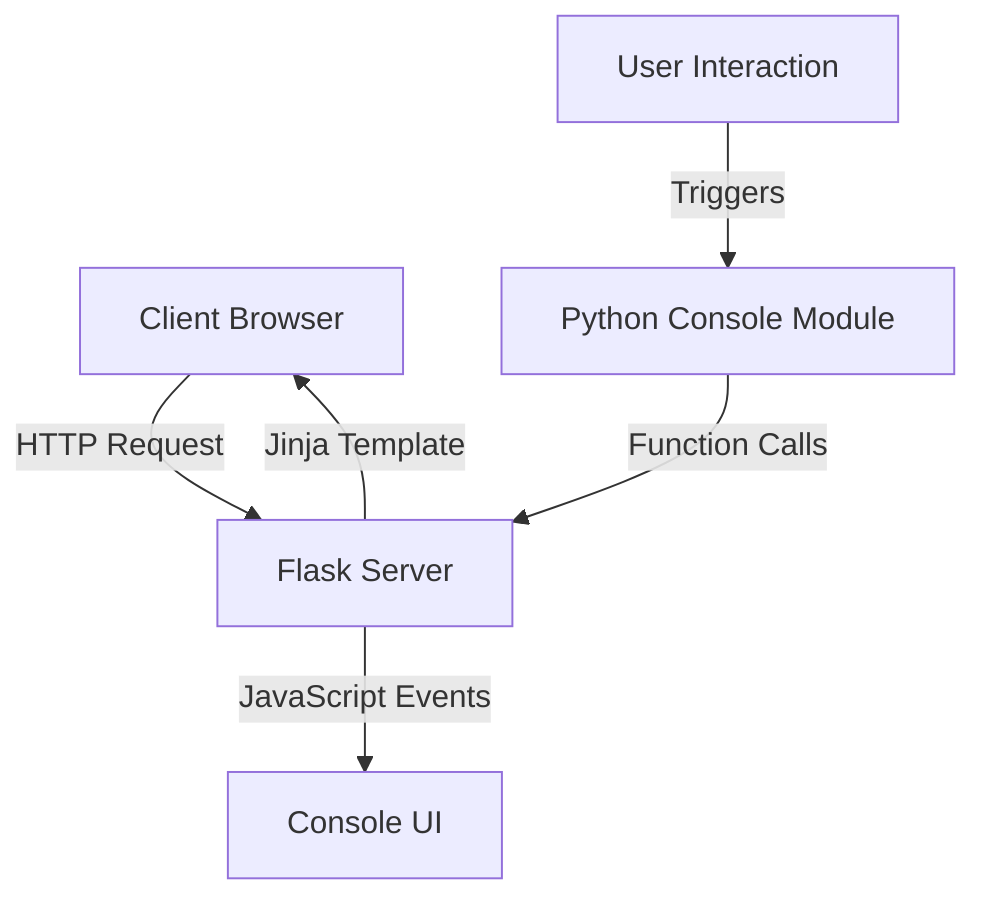

# Design Document: Console Functionality with Flask and Jinja

## Overview

This design document outlines the implementation approach for enhancing the console functionality in the AI Transcription and Response UI. The enhancements include integrating Flask and Jinja templating for server-side rendering and adding new console commands ("clear" and "printl") that can be triggered from Python.

## Architecture

The architecture will follow a client-server model:

1. **Server-side**: Flask application serving Jinja templates
2. **Client-side**: Browser rendering HTML/CSS/JS with console functionality
3. **Communication**: Server-side Python functions will communicate with the client-side console via Flask routes and JavaScript



## Components and Interfaces

### 1. Flask Application

The Flask application will serve as the main entry point and will be responsible for:

- Serving the main application page using Jinja templates
- Providing API endpoints for console operations
- Managing application state

**Interface:**
```python
# app.py
from flask import Flask, render_template, jsonify, request
from scripts.python.console import Console

app = Flask(__name__)
console = Console()

@app.route('/')
def index():
    return render_template('index.html')

@app.route('/api/console/print', methods=['POST'])
def console_print():
    message = request.json.get('message')
    console.printl(message)
    return jsonify({"status": "success"})

@app.route('/api/console/clear', methods=['POST'])
def console_clear():
    console.clear()
    return jsonify({"status": "success"})

if __name__ == '__main__':
    app.run(debug=True)
```

### 2. Console Python Module

A dedicated Python module (`console.py`) will handle all console-related operations:

**Interface:**
```python
# scripts/python/console.py
import datetime
import json
from flask import current_app
from flask_socketio import SocketIO

class Console:
    def __init__(self, socketio=None):
        self.socketio = socketio or SocketIO(current_app)
    
    def printl(self, message):
        """Add a new message to the console"""
        timestamp = datetime.datetime.now().strftime("%H:%M:%S")
        formatted_message = f"> [{timestamp}] {message}"
        self.socketio.emit('console_message', {'message': formatted_message})
        return formatted_message
    
    def clear(self):
        """Clear the console and add a 'Console Cleared' message"""
        self.socketio.emit('console_clear')
        self.printl("Console Cleared")
```

### 3. Jinja Templates

The existing HTML structure will be converted to Jinja templates:

**Template Structure:**
```
templates/
├── base.html          # Base template with common structure
├── index.html         # Main application template
└── components/
    └── console.html   # Console component template
```

### 4. Client-side JavaScript

JavaScript will handle the real-time updates to the console UI:

**Interface:**
```javascript
// console.js
const socket = io();

// Handle incoming console messages
socket.on('console_message', function(data) {
    addConsoleMessage(data.message);
});

// Handle console clear command
socket.on('console_clear', function() {
    clearConsole();
});

function addConsoleMessage(message) {
    const consoleElement = document.getElementById('console-output');
    const messageElement = document.createElement('div');
    messageElement.textContent = message;
    messageElement.className = 'console-row';
    consoleElement.appendChild(messageElement);
    
    // Auto-scroll to bottom
    consoleElement.scrollTop = consoleElement.scrollHeight;
}

function clearConsole() {
    const consoleElement = document.getElementById('console-output');
    consoleElement.innerHTML = '';
}
```

## Data Models

### Console Message

```javascript
{
    "message": string,  // The message content
    "timestamp": string // Time in HH:MM:SS format
}
```

## Error Handling

1. **Connection Issues**: If WebSocket connection fails, fall back to polling
2. **Message Formatting**: Sanitize input to prevent XSS attacks
3. **Rate Limiting**: Implement throttling for rapid message additions
4. **Error Logging**: Log errors to both server logs and console UI with distinct styling

## Testing Strategy

1. **Unit Tests**:
   - Test console.py functions in isolation
   - Verify message formatting
   - Test clear functionality

2. **Integration Tests**:
   - Test Flask routes
   - Verify WebSocket communication
   - Test Jinja template rendering

3. **End-to-End Tests**:
   - Verify console updates from Python to UI
   - Test multiple rapid messages
   - Test clear functionality in full application context